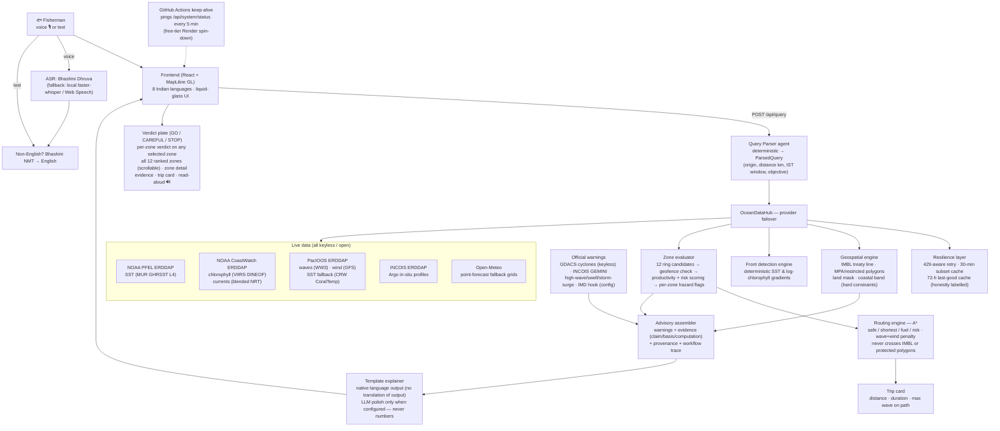

# ORCA — Marine Ecosystem Reasoning with Collaborative Agents

**SIH26176** — an agentic marine decision-support prototype for Indian fishermen.

**Live:** frontend <https://sih.lebronpereira.in> · backend <https://orca-backend-whvh.onrender.com> (API reference at `/docs`)

Ask in natural language or voice:

> *“Where is the safest and most productive fishing zone 20 km off Rameswaram tomorrow morning?”*

ORCA parses the request, retrieves **real** ocean/weather/geospatial data through official
provider APIs, runs **deterministic** scientific/geospatial engines (front detection,
hazard scoring, A* routing), checks maritime safety constraints (IMBL proximity,
protected areas), ranks candidate fishing zones, and returns an **evidence-backed**
recommendation with full provenance on an interactive map.

## The critical design rule

```
LLM  = reasoning, orchestration, explanation        (never computes science)
Engines = data retrieval + deterministic calculation (never hallucinated)
```

The LLM never answers “is this point inside the IMBL?”, never invents an SST value,
and never fabricates a wave height. It calls tools; the tools compute; every number
carries provenance (`source`, `dataset`, `retrieved_at`, `valid_time`, `unit`,
`confidence`, `mode`). When data is missing, ORCA says **“INSUFFICIENT_DATA”**.

## Workflow

The full pipeline of one query — every box is real code in this repo:



## Live data sources (all open / keyless)

| Variable | Primary source | Link | Fallback |
| --- | --- | --- | --- |
| Sea surface temperature | MUR GHRSST L4 (NASA JPL), 0.01°, daily | [jplMURSST41 @ NOAA PFEL](https://coastwatch.pfeg.noaa.gov/erddap/griddap/jplMURSST41) | CRW CoralTemp 5 km daily ([dhw_5km @ PacIOOS](https://pae-paha.pacioos.hawaii.edu/erddap/griddap/dhw_5km)) |
| Chlorophyll-a | VIIRS S-NPP/NOAA-20, DINEOF gap-filled, 9 km, NRT daily | [noaacwNPPN20VIIRSDINEOFDaily @ CoastWatch](https://coastwatch.noaa.gov/erddap/griddap/noaacwNPPN20VIIRSDINEOFDaily) | 72-h last-good cache, honestly labelled |
| Ocean currents | Blended NRT geostrophic (altimetry), 0.25°, daily | [noaacwBLENDEDNRTcurrentsDaily @ CoastWatch](https://coastwatch.noaa.gov/erddap/griddap/noaacwBLENDEDNRTcurrentsDaily) | Open-Meteo derived grid |
| Significant wave height | WAVEWATCH III global, 0.5°, hourly +7 d | [ww3_global @ PacIOOS](https://pae-paha.pacioos.hawaii.edu/erddap/griddap/ww3_global) | Open-Meteo marine |
| Wind (u/v 10 m) | NCEP GFS, 0.5°, 3-hourly +7 d | [ncep_global @ PacIOOS](https://pae-paha.pacioos.hawaii.edu/erddap/griddap/ncep_global) | Open-Meteo |
| SST anomaly | NOAA Coral Reef Watch v3.1, 5 km, daily | [dhw_5km (CRW_SSTANOMALY) @ PacIOOS](https://pae-paha.pacioos.hawaii.edu/erddap/griddap/dhw_5km) | — |
| In-situ profiles | INCOIS Indian Argo floats | [Indian_ARGO_Floats @ INCOIS](https://erddap.incois.gov.in/erddap/tabledap/Indian_ARGO_Floats) | — |
| Point forecasts (fallback) | Open-Meteo marine & weather | [open-meteo.com](https://open-meteo.com/) | — |
| Cyclone alerts | GDACS (EC JRC), keyless RSS | [gdacs.org](https://www.gdacs.org/) | INCOIS GEMINI high-wave/swell/storm-surge |
| Maritime boundaries | India–Sri Lanka IMBL treaty line, VLIZ maritime regions | [marineregions.org](https://www.marineregions.org/) | committed GeoJSON in `data/` |
| Voice (ASR/NMT/TTS) | Bhashini Dhruva (MeitY NLTM) | [bhashini.gov.in](https://bhashini.gov.in) | local faster-whisper + edge-tts, Web Speech |

Swapping or adding a source is a **`datasets.json` entry, not a code change** —
variables map to fallback *chains* (priority-ordered), the hub tries servers by
configured priority, and staleness is flagged, never hidden.

## Tech stack

| Layer | Choice | Why |
| --- | --- | --- |
| Backend | Python 3.11+, FastAPI, Pydantic v2 | typed API contracts mirrored 1:1 in the frontend `types.ts` |
| Ocean science | erddapy, xarray, netCDF4, numpy, scipy, pandas | ERDDAP subsetting + gridded windows without downloading full datasets |
| Geospatial | geopandas, shapely, pyproj, geojson-pydantic | IMBL/MPA geofencing, distances, bearings — deterministic |
| Routing | A* (custom, `app/engines/routing`) | safe/shortest/fuel/risk modes with hard constraint pruning |
| Persistence | SQLite + SQLAlchemy (PostGIS optional via Docker) | query log; spatial DB not required for the demo |
| Voice | Bhashini Dhruva; fallback faster-whisper + edge-tts; client Web Speech | works with zero keys, better with keys |
| Frontend | React 19, TypeScript 5, Vite 6, MapLibre GL 6 | no map API key, free basemaps |
| i18n | hand-rolled dictionary, 8 languages (en, ta, te, ml, hi, bn, or, gu) | fishermen-facing labels translated, template explainer native |
| Infra | Render (backend) + Vercel (frontend) + GitHub Actions keep-alive | free tier, zero-cost demo |
| Tests | pytest, 37 tests incl. 8 mandated critical tests | run fully offline |

## Problem-statement coverage

Audited against SIH26176 in [docs/REQUIREMENTS_COVERAGE.md](docs/REQUIREMENTS_COVERAGE.md)
(every ✅ names the code path that proves it). Summary:

- ✅ PFZ-style zone ranking, safe-to-venture verdict, chlorophyll + SST favourability,
  safe route optimization, hazardous/geofenced-zone avoidance
- ✅ NL intent understanding, autonomous dataset discovery + failover, spatial/temporal
  reasoning across sources, explainable evidence + maps, multi-agent modularity,
  geofencing (IMBL / MPA / restricted), reliable provenance-backed recommendations
- 🟡 honest gaps: **tides** not ingested, **lightning** has no feed, **multi-turn
  conversation** and **language auto-detect** pending (see *Future scope*)

## Feasibility & viability

**Technical feasibility — proven, running.** The stack is deployed and serving real
advisories on free tiers (Render 512 MB + Vercel). Every data source is keyless/open
(or optionally Bhashini/INCOIS keys), so there is no procurement blocker. The provider
layer degrades gracefully: host-down circuit breakers, 429-aware retries, a short-TTL
subset cache, per-variable fallback chains, and a 72-h last-good cache that serves the
last real observations honestly labelled. The 37-test suite runs fully offline.

**Economic viability — zero recurring cost at demo scale.** No paid APIs, no map keys,
free hosting. Scaling cost is bandwidth/compute on commodity hosting; the heavy assets
(satellite grids) stay on the providers' own ERDDAPs — ORCA fetches only small bounding
boxes, so per-request cost stays in kilobytes.

**Operational viability — built for the field.** Voice-first interaction in 8 Indian
languages, verdict plates designed for low-literacy users (GO / CAREFUL / STOP with
icons), read-aloud output, mobile-responsive layout. For production deployment the
config-only hooks to INCOIS (GEMINI alerts, ERDDAP) and IMD (warnings) mean an
authoritative Indian backend can replace international primaries **without code
changes** — this is the intended path to a government-blessed deployment.

**Viability risks, stated:** ERDDAP public hosts throttle cloud egress IPs
(mitigated by retries/caches, eliminated by partnering with INCOIS for Indian hosting);
recommendation weights are heuristic until validated against catch data (labelled as
such in the UI).

## Impact & benefits

- **Safety of life at sea** — IMBL and protected-area hard geofences, rough-sea and
  strong-wind cautions per zone, official cyclone / high-wave / swell alerts, routes
  that never cross hard boundaries, max-wave-on-path in the trip card.
- **Livelihood** — SST + chlorophyll front detection ranks zones where fish actually
  aggregate, cutting blind fuel-burning search time; distance/bearing/trip cost are
  shown before departure.
- **Inclusion** — speaks the user's language (8 languages), listens and talks back,
  avoids literacy barriers, works on a phone.
- **Trust** — every number carries source, dataset, retrieval and valid time, unit and
  quality flag; missing data is announced (`INSUFFICIENT_DATA`), stale data is badged
  CACHED with its true date; the LLM cannot override any computation.
- **Institutional** — complements INCOIS PFZ bulletins with a conversational, map-first
  front end; evidence records (claim/basis/computation) are auditable end-to-end.

## Future scope

1. **Multi-turn conversation** — session-scoped state to diff follow-ups against the
   last `ParsedQuery` (“what about tomorrow?”, “further out”, “zone 3”).
2. **Tides** — ingest a tidal-harmonic product for the pilot coast as a provider entry;
   tide state on the trip card.
3. **Lightning nowcast** — wire the existing IMD config hook to a thunderstorm nowcast
   feed (`OFFICIAL_LIGHTNING` warning code; the template machinery is already generic).
4. **Language auto-detection** — script-range detection on the query path (Bhashini
   language-ID when configured) instead of selector-picked language.
5. **Indian primaries** — swap `datasets.json` entries to INCOIS/MosDAC gridded NRT
   products as they become available on reachable endpoints.
6. **Offline/low-connectivity** — PWA with the last advisory cached on-device; SMS/IVR
   channel for feature-phone users.
7. **Model validation** — partner with fishing communities to log catch outcomes and
   calibrate the productivity weights from data instead of heuristics.
8. **Fleet features** — shareable zone links, community-reported hazards, group advisories.

## Research & references

- Beckers, J.-M. & Rixen, M. (2003). *EOF calculations and data filling from
  incomplete oceanographic datasets.* J. Atmos. Oceanic Technol., 20(12) — the DINEOF
  method behind the gap-filled chlorophyll product.
- Alvera-Azcárate, A. et al. (2005). *Reconstruction of incomplete oceanographic data
  using a neural-network-based technique (DINEOF).* JGR Oceans.
- O'Reilly, J.E. et al. (1998, 2012). *Ocean color chlorophyll algorithms (OC3/OC4).*
  NASA Ocean Biology DAAC.
- JPL GHRSST MUR L4 SST analysis — NASA/JPL Physical Oceanography DAAC
  (<https://podaac.jpl.nasa.gov/dataset/MUR-JPL-L4-GLOB-v4.1>).
- NOAA Coral Reef Watch v3.1 daily 5 km products — CoralTemp SST
  (<https://coralreefwatch.noaa.gov/product/5km/index.php>).
- NOAA CoastWatch blended near-real-time geostrophic currents —
  <https://coastwatch.noaa.gov>.
- NOAA/NCEP WAVEWATCH III global wave model — <https://polar.ncep.noaa.gov/waves/>.
- Hart, P.E., Nilsson, N.J. & Raphael, B. (1968). *A formal basis for the heuristic
  determination of minimum cost paths.* IEEE Trans. SSC — A*.
- Simons, R. — ERDDAP data server, NOAA NMFS SWFSC (<https://coastwatch.pfeg.noaa.gov/erddap>).
- INCOIS Potential Fishing Zone advisory methodology and GEMINI high-wave/swell/storm-surge
  alerts — Indian National Centre for Ocean Information Services (<https://incois.gov.in>).
- FAO/ILO/IMO (2013, rev.). *Safety recommendations for decked fishing vessels of less
  than 12 m* — safety-constraint framing.
- GDACS — Global Disaster Alert and Coordination System, EC JRC / UN OCHA
  (<https://www.gdacs.org>).
- Bhashini / National Language Translation Mission, MeitY (<https://bhashini.gov.in>).
- Flanders Marine Institute (VLIZ) maritime boundaries —
  <https://www.marineregions.org>.

## Quick start (local, no Docker)

```bash
# backend
cd backend
python -m venv .venv && .venv\Scripts\activate     # Windows
pip install -r requirements.txt
copy ..\.env.example ..\.env                        # then edit as needed
uvicorn app.main:app --reload --port 8000

# frontend (new terminal)
cd frontend
npm install
npm run dev            # http://localhost:5173
```

Open **http://localhost:8000/docs** for the API reference.

> The system boots in **DEMO mode** by default (cached data, clearly labelled).
> Set `ORCA_DATA_MODE=live` in `.env` (gitignored) to fetch from the configured
> live providers. Live queries take ~20–30 s (several datasets are fetched and
> merged per request; a repeat query within 30 min is served from the subset
> cache). Public ERDDAP hosts occasionally throttle or drop cloud egress IPs —
> the hub retries (429-aware), falls through the provider chain, and serves the
> last successful field for up to 72 h, **honestly labelled** — otherwise it
> reports MISSING rather than inventing a value. Reference boundary layers
> (India–Sri Lanka IMBL treaty lines, protected areas, land masks) load in
> **both** modes.
>
> **Why NOAA/PacIOOS serve the forecast fields and not INCOIS/MOSDAC**: the
> provider layer is deliberately source-agnostic — INCOIS *is* in the chain
> (Argo profiles via INCOIS ERDDAP, and official High-Wave/Swell/Storm-Surge
> alerts via the GEMINI API when `ORCA_INCOIS_API_KEY` is set), but INCOIS's
> gridded ERDDAP holdings end 2011, so live forecast fields come from whichever
> provider publishes current numeric grids (NOAA/PacIOOS/Open-Meteo). Swapping
> in an Indian provider is a `datasets.json` entry, not a code change. Cyclone /
> high-wave warnings ingest from GDACS (keyless) + INCOIS GEMINI + a config-only
> IMD hook — see `app/providers/official_warnings.py`.

### Demo data pack

The Rameswaram demo pack (real cached ERDDAP subsets + Open-Meteo + VLIZ IMBL
geometry) is committed under `data/demo/rams/` with full provenance in
`manifest.json` and attribution in `ATTRIBUTION.md`. To rebuild or refresh it
from live sources:

```bash
cd backend
.venv/Scripts/python -X utf8 scripts/fetch_demo_data.py
```

### Tests

```bash
cd backend
.venv/Scripts/python -m pytest tests/ -v
```

37 tests, including the **eight mandated critical tests**
([backend/tests/test_critical.py](backend/tests/test_critical.py)):

1. a restricted/protected polygon is never traversed (A* detours or gives up)
2. a route never crosses the IMBL hard boundary (unreachable ⇒ blocked, never invented)
3. missing data is never fabricated (empty pack ⇒ `INSUFFICIENT_DATA`, no recommendation)
4. stale/cached data is always flagged `STALE` with a DEMO/CACHED note
5. user constraints survive the pipeline (distance, place, IST time window, objectives)
6. every evidence claim maps to a real measurement with provenance
7. demo mode is visibly labeled (banner + `DEMO_MODE` warning + provenance envelope)
8. every available measurement carries an explicit unit

Plus the resilience suite ([tests/test_last_good_cache.py](backend/tests/test_last_good_cache.py)):
an outage serves the last real field honestly labelled, and never past its
72-hour representative horizon.

Tests run fully offline: geocoding is monkeypatched off and Bhashini/Dhruva
HTTP is stubbed.

### Voice & translation

Voice input (🎙) and read-aloud (🔊) work **without any API key**: when Bhashini
is not configured the UI falls back to the browser's built-in Web Speech API
(Chrome/Edge recommended), with a server-side faster-whisper + edge-tts option
available. Speech recognition runs on-device in the fallback path, and the UI
honestly labels the voice it uses — never as Bhashini when it is not.

To enable Bhashini (better Indian-language ASR / translation / TTS):

1. Register at <https://bhashini.gov.in> and obtain Dhruva API credentials.
2. Copy `.env.example` → `.env`, set `ORCA_BHASHINI_ENABLED=true`,
   `ORCA_BHASHINI_API_KEY=…` and the `ORCA_BHASHINI_*_SERVICE_ID` values.
3. Restart the backend. `GET /api/voice/status` then reports `configured: true`
   and the UI automatically prefers Bhashini over the fallback voice.

`GET /api/voice/status` always reports what is actually available — the UI never
pretends a voice service is configured when it is not.

## Docker

```bash
cp .env.example .env
docker compose up --build
```

Brings up `postgis` (spatial database), `backend` (FastAPI), `frontend` (Vite build
served by nginx). PostGIS is **optional** for development — the geospatial engine
works on file-based GeoJSON/GeoPackage layers without a database.

## Documentation

| Doc | Contents |
| --- | --- |
| [docs/REQUIREMENTS_COVERAGE.md](docs/REQUIREMENTS_COVERAGE.md) | full audit against the SIH26176 statement, with code-path evidence |
| [docs/OPEN_SOURCE_RESEARCH.md](docs/OPEN_SOURCE_RESEARCH.md) | inspected OSS projects, verdicts (direct dep / adapt / reference / reject), licenses |
| [docs/ARCHITECTURE.md](docs/ARCHITECTURE.md) | agent graph, data flow, LLM-vs-tools boundary, scoring model |
| [docs/IMPLEMENTATION_PLAN.md](docs/IMPLEMENTATION_PLAN.md) | phase plan mapped to concrete deliverables |
| [THIRD_PARTY_LICENSES.md](THIRD_PARTY_LICENSES.md) | third-party license inventory and compatibility notes |
| [docs/SAFETY.md](docs/SAFETY.md) | non-negotiable safety & trust requirements |

## Safety posture (non-negotiable)

- Never fabricate weather, waves, currents, boundaries, protected areas, or warnings.
- Hard constraints (IMBL / maritime boundary, protected polygons, land) can **never**
  be overridden by an LLM or a soft cost.
- Every recommendation ships with timestamp, sources, valid time, confidence and warnings.
- Demo/cached data is always visibly labelled **“DEMO / CACHED DATA”**.
- Reference GIS boundaries are distinguished from legally authoritative ones.

*Prototype decision weights are heuristic and clearly labelled as such — not a
scientifically validated fish-stock or safety model.*
